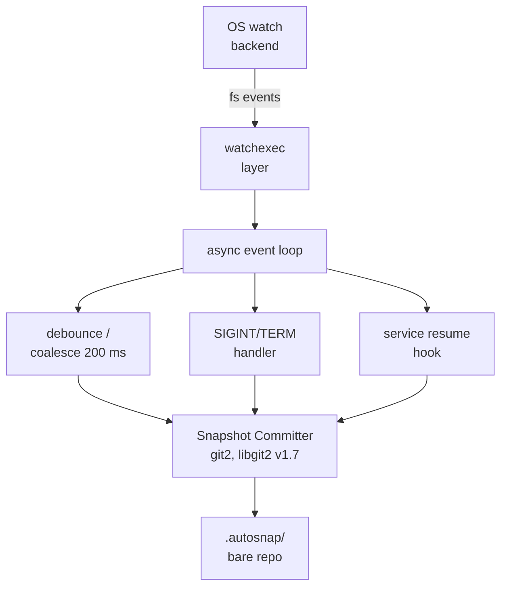

## **git-autosnap (Rust) — Technical Specification**

### 1. Overview

`git-autosnap` is a single-binary Git extension that **records timestamped snapshots of a working tree into a local *bare* repository** whenever files change.

* Pure-Rust implementation
* Uses **`git2`** (libgit2 bindings) for Git I/O
* Uses **`watchexec`** for file watching with built-in .gitignore support and debouncing/throttling
* Runs as a long-lived background process (« watcher »), controllable via sub-commands

---

### 2. Goals / Non-Goals

|         | Goals                                                                               | Non-Goals                                               |
| ------- | ----------------------------------------------------------------------------------- | ------------------------------------------------------- |
| **G-1** | Zero impact on the team’s shared repo history (snapshots live only in `.autosnap/`) | Distributed backup to remote storage                    |
| **G-2** | Respect `.gitignore` and existing Git attributes                                    | Full VCS features (branch merges, reflog GC are manual) |
| **G-3** | Start/stop easily                                                                   | Cross-repo "global" watcher                             |
| **G-4** | No external runtime deps beyond Git & libc                                          | Cross-platform support beyond macOS                     |

---

### 3. High-Level Architecture



---

### 4. Core Components

#### 4.1 Watcher

* **Backend** : `watchexec::Watchexec` (Tokio 1 runtime)
* **Path-set** : repo root, recursive
* **Ignore rules** : `watchexec` built-in .gitignore support + hard-coded
  `/.git/, /.autosnap/`
* **Debounce/Throttle** : 200 ms sliding window (provided by watchexec)

#### 4.2 Git Layer

* Open **bare repo** at `./.autosnap/` (created by `git autosnap init`)
* Automatically adds `.autosnap` to `.git/info/exclude` during init to prevent it from appearing in `git status`
* `Repository::set_workdir()` points to the **main working directory**
* Snapshot algorithm:

  1. `index.add_all(["*"], IndexAddOption::DEFAULT, None)`
  2. `index.write()` + `index.write_tree()`
  3. Build commit

     ```rust
     let msg = format!("AUTOSNAP[{branch}] {iso_ts}");
     repo.commit(Some("HEAD"), &sig, &sig, &msg, &tree, &parents)?;
     ```

  4. *(Optional)* prune: `repo.gc(prune=30 days)`

#### 4.3 Commit-message Format

```
AUTOSNAP[<branch-or-DETACHED>] <ISO8601 timestamp with offset>
```

#### 4.4 CLI Surface

```text
git autosnap init         # initialize .autosnap bare repository and add to .git/info/exclude
git autosnap start        # launch watcher in foreground
git autosnap start --daemon  # launch watcher in background (daemonize)
git autosnap stop         # send SIGTERM to pid in .autosnap/autosnap.pid
git autosnap status       # exit 0 if running
git autosnap once         # take one snapshot and exit
git autosnap gc           # prune snapshots older than --days N (default 60)
git autosnap uninstall    # stop watcher if running and remove .autosnap directory
```

#### 4.5 Process Control

* **PID-file** : `.autosnap/autosnap.pid` (repository-local)
* Single-instance lock via `fs2::FileExt::try_lock_exclusive()`
* When launched with `--daemon`, process forks and detaches from terminal
* Graceful shutdown on `SIGINT`, `SIGTERM` → flush pending commit
* Optional **pause/resume** on `SIGUSR1` / `SIGUSR2`

---

### 5. Configuration (via `git config`)

Configuration is managed through git config with the `autosnap` section:

```bash
# Set configuration values
git config autosnap.debounce-ms 300
git config autosnap.gc.prune-days 45

# Read configuration values
git config autosnap.debounce-ms                    # returns: 300
```

Configuration lookup follows standard Git precedence: local (.git/config) → global (~/.gitconfig) → system.

---

### 6. Error Handling & Logging

* **Error Handling**:
  * **`anyhow`** for application-level error propagation with context
  * **`thiserror`** for defining custom error types with proper error chains
* **Logging**:
  * **`tracing`** for structured logging and async-aware diagnostics
  * Logs to `stderr` by default; when started by a service, redirect to `StandardOutPath` in plist
  * Configurable log levels via `RUST_LOG` environment variable

---

### 7. Building & Packaging

```bash
cargo build --release
install -m755 target/release/git-autosnap $(git --exec-path)/
```

Static linking produces a single \~5 MB binary (libgit2 + OpenSSL).

---

### 8. Security / Licensing

* `git2` / libgit2 → **LGPL-2.1**; static builds must ship re-link info
* No network I/O; writes only under repo directory
* PID file permissions 0600

---

### 9. Quick Start (TL;DR)

```bash
# inside an existing Git repo
git autosnap init           # setup .autosnap bare repository and add to .git/info/exclude
git autosnap start --daemon # launch in background
# …edit files…
git autosnap stop           # stop the daemon

# cleanup when no longer needed
git autosnap uninstall      # remove all traces
```
